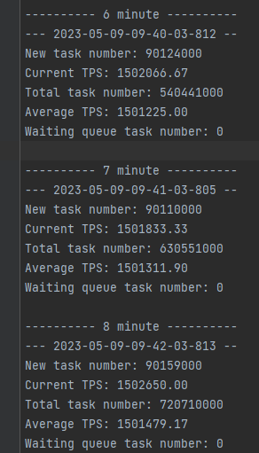

# 极限值

- windows 单核：37.5W
- windows 20 核：750W
- Linux 单核：28W
- Linux 12 核：336W
- 网络 100M：(100 * 1024 * 1024)/(44 * 8) = 297890 = 29.79W TPS
- 网络 1000M：29.79W * 10 = 297.89W TPS

# 总览

- 服务器峰值：2420000 TPS
- 个人 PC 峰值：4800000 TPS

# 心得

- 调优需要有针对性优化：使用性能分析工具分析性能瓶颈，而不是靠自己猜想，只有这样才能找到问题所在并进行优化，快速定位问题
- 细节决定成败，一个小小的改动也会带来巨大的变化，需要考量每一行代码，并对代码进行优化
- IO 读写速度远远慢于 CPU 执行速度，是 CPU 的几倍甚至几十倍的时间，尽可能的减少 IO 次数能够提高处理速度
- 提高 CPU 利用率是突破 TPS 的关键，若任务的执行时间太短，会导致 CPU 没运行多久就进行切换，利用率低下，因此通过提高单一线程的执行任务时间能够使得效率提升
- 减少 String 对象的产生，能够降低 gc 的频率，从而保证程序的稳定运行
- 通过字节数组直接传输字节数据，能够减少接收双方的数据处理时间
- 分离处理和数据传送逻辑，能够使得处理能力大大提升
- 尽可能的复用内存块，减少内存空间的开销，降低 gc 频率，提高服务稳定性

# 调优过程

## 第一次设计与测试

- 并发度：目标 100 TPS
- 问题：计数数据丢失
- 原因：更新变量时没有进行保护和使用原子化操作
- 改进技术点：将计数变量使用 volatile 修饰，并使用原子化操作

## 第二次设计与测试

- 并发度：目标 100 TPS
- 问题：收集器的采样数据有将近 20% 的错误率
- 原因：MessageDigest 不是线程安全的，
- 改进技术点：实例对象从成员变量改为临时变量，在每一次计算重新获取实例

## 第三次设计与测试

- 并发度：目标 40000 TPS，达成
- 改进技术点：动态获取当前运行 PC 的核心数，将线程池的线程数量定为：核心数 + 1

## 第四次设计与测试

- 并发度：目标 50000 TPS，实际达到 40000 TPS，无提升，此时未找到准确的性能瓶颈
- 改进技术点：将执行器的计数方式改为从线程池中的方法获取，已完成任务数 `threadPool.getCompletedTaskCount()`，等待任务数 `threadPool.getQueue().size()`

## 第五次设计与测试

- 并发度：目标 80000 TPS，执行器达到 70000 TPS 左右
- 改进技术点：
  - 通过 IDEA 的性能分析器 Profiler 分析性能耗时，发现大部分耗时在 TCP 读写上
  - 将 TCP 的读写 DataOutputStream 和 DataInputStream 改为 BufferedReader 和 BufferedWriter 并设置缓冲区大小，本质是减少 IO 次数

上图为示意，并非真实调优过程中的图

## 第六次设计与测试

- 并发度：目标 200000 TPS，执行器达 150000 TPS
- 问题：存在数据丢失问题
- 原因：触发到线程池拒绝策略
- 改进技术点：
  - 通过 profiler 发现 TCP 在传输的过程中的刷新函数 `flush` 开销较大
  - 将传输一次任务刷新一次，改为定时刷新，建立定时刷新输出流线程

## 第七次设计与测试

- 并发度：目标 200000 TPS，执行器达 200000 TPS，程序稳定运行 16h
- 改进技术点：调整线程池队列大小，避免拒绝策略的触发

## 第八次设计与测试

- 并发度：目标 300000 TPS
- 问题：收集器发生 OOM
- 原因：收集器将执行完成的任务收集到队列中，由于任务数量太大，导致内存不够用
- 改进技术点：不记录一分钟所产生的所有任务，在接收的过程中通过拒绝采样，并通过原子计数器记录任务数量

## 第九次设计与测试

- 并发度：目标 500000 TPS，达成

## 第十次设计与测试

- 问题：发现 CPU 利用率依旧不高，在 30% 左右，大部分是空闲状态，瓶颈依旧在 TCP 传输上

- 改进技术点：降低 IO 次数，提高 CPU 利用率
  - 收集器：将一次传输一次任务，改为一次传输一批任务
  - 执行器：一个线程执行一批任务
- CPU 利用率：达到 100%

- 并发度：目标 600000 TPS，达成

## 第十一次设计与测试

- 改进技术点：
  - 生成器：采用间断性平滑生成任务的方式，每 10 ms 生成一批任务
  - 执行器：将执行完成的任务添加到缓存队列中，并启动一个专门的线程与收集器传输
  - 数据传输：各个服务之间采用字节传输，提高效率
  - 缓存优化：通过空间复用，仅申请一次空间，减少内存消耗
- 并发度：目标 1300000 TPS，达成

## 第十二次设计与测试

- 问题：每次执行一次任务申请一次 MessageDigest 实例，空间效率低
- 改进：
  - 将 MessageDigest 的申请放到 BatchTask 中，一批任务申请一次 MessageDigest
  - 每个任务执行完后重置 MessageDigest 的状态，进行复用
- 并发度：目标 1500000 TPS，达成

## 第十三次设计与测试

- 改进技术点：

  1. 数据接收方读取时将 read 函数改为 readfully，保证缓冲区读满数据
  2. 将 sha256 的执行结果直接写入 buffer 中，不再申请内存空间
  3. 通过 threadlocal 存放线程本地变量，包括 sha256 计算 buffer、MessageDigest 实例，一直使用到执行结束
  4. 执行器预先申请若干个 BatchTaskExecutor，通过对象池进行管理，执行过程中反复使用，避免内存申请导致 gc
  5. 执行器执行的结果直接写入到 writeBuffer 中，删除了任务缓存队列，降低空间开销
  6. collector 一次读取一个任务改为一次读取 Batch 任务
  7. collector 申请 SAMPLE\_NUM 的 byte[] 数组，用于存放采样的任务的结果
- 并发度：目标 2000000 TPS，达成，CPU 利用率 80%

## 第十四次设计与测试

- 问题：在 linux 上测试，TPS 只会达到 267333.33，我们三个人测试都不约而同得到这个数字
- 原因：host3 网卡速率为 100M，host1 和 host2 均为 1000M，host3 的速率限制了并发度的提升

- 并发度：Linux 目标 180W TPS，达成，host3 网卡速率改为 1000M

## 第十五次设计与测试

- 现象：300W TPS 暴力压测以后，PC 能够达到的 TPS 仅有 100W，理论上处理不过来会丢弃也不应该降低 TPS
- 改进计数点：
  - 统一 generator，executor，collector 的 batch 大小，batch 大小不同会导致 IO 时数据不断切分，效率低下
  - 将 readfully 函数改为循环 read，降低 IO 等待时间
- 并发度：PC 415W TPS

## 第十六次设计与测试

- 现象：在 linux 测试 generator 的带宽只能跑到 170M，但是陈雯和王珅都能跑到 240M，同时排查了并不是代码的问题
- 原因：他们在 linux 上测试登录的是 host3 用户，host3 用户的 jdk 是 20，host 用户是 8
- 并发度：最终我也用 jdk20 跑，成功跑满网络代码，242w TPS
