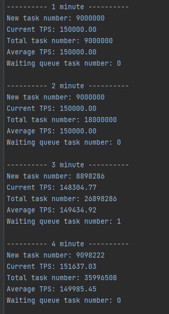
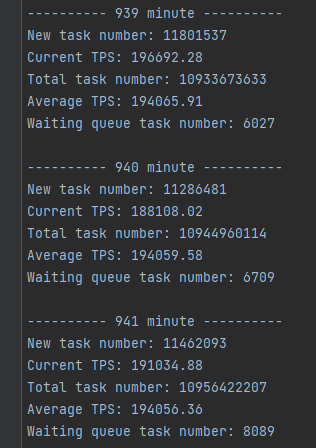

# 总览

- 服务器峰值：
- 个人 PC 峰值：600000 TPS

# 心得

- 调优需要对症下药：使用性能分析工具分析性能瓶颈，而不是靠自己猜想，只有这样才能找到问题所在并进行优化，快速定位问题
- 细节决定成败，一个小小的改动也会带来巨大的变化，需要考量每一行代码，并对代码进行优化
- IO 读写速度远远慢于 CPU 执行速度，是 CPU 的几倍甚至几十倍的时间，尽可能的减少 IO 次数能够提高处理速度
- 提高 CPU 利用率是突破 TPS 的关键，若任务的执行时间太短，会导致 CPU 没运行多久就进行切换，利用率低下，因此通过提高单一线程的执行任务时间能够使得效率提升
- 减少 String 对象的产生，能够降低 gc 的频率，从而保证程序的稳定运行

# 调优过程

## 第一次设计与测试

- 并发度：100 TPS 计数数据不丢失，此时的 100 TPS 并不是峰值，只是测试
- 改进技术点：将计数变量使用 volatile 修饰，并使用原子化操作

## 第二次设计与测试

- 并发度：100 TPS，但发现收集器的采样数据有将近 20% 的错误率
- 改进技术点：MessageDigest 不是线程安全的，在每次执行时需要重新获取实例

## 第三次设计与测试

- 并发度：40000 TPS，达成
- 改进技术点：动态获取当前运行 PC 的核心数，将线程池的线程数量定为：核心数 + 1

## 第四次设计与测试

- 并发度：目标 50000 TPS，实际达到 40000 TPS，无提升，此时未找到准确的性能瓶颈
- 改进技术点：将执行器的计数方式改为从线程池中的方法获取，已完成任务数 `threadPool.getCompletedTaskCount()`，等待任务数 `threadPool.getQueue().size()`

## 第五次设计与测试

- 并发度：目标 80000 TPS 测试，执行器达到 70000 TPS 左右
- 改进技术点：
  - 通过 IDEA 的性能分析器 Profiler 分析性能耗时，发现大部分耗时在 TCP 读写上
  - 将 TCP 的读写 DataOutputStream 和 DataInputStream 改为 BufferedReader 和 BufferedWriter 并设置缓冲区大小，本质是减少 IO 次数

上图为示意，并非真实调优过程中的图

## 第六次设计与测试

- 并发度：200000 TPS 测试，执行器达 150000 TPS，存在数据丢失问题（由于线程池拒绝策略造成）
- 改进技术点：
  - 通过 profiler 发现 TCP 在传输的过程中的刷新函数 `flush` 开销较大
  - 将传输一次任务刷新一次，改为定时刷新，建立定时刷新输出流线程

## 第七次设计与测试

- 并发度：200000 TPS 测试，执行器达 200000 TPS，程序稳定运行 16h
- 改进技术点：调整线程池队列大小，避免拒绝策略的触发

## 第八次设计与测试

- 并发度：300000 TPS 测试，收集器发生 OOM
- 改进技术点：不记录一分钟所产生的所有任务，在接收的过程中通过概率采样，并通过原子计数器记录任务数量

## 第九次设计与测试

- 并发度：暴力测试 500000 TPS，达成

## 第十次设计与测试

- 问题：发现 CPU 利用率依旧不高，在 30% 左右，大部分是空闲状态，瓶颈依旧在 TCP 传输上

- 改进技术点：降低 IO 次数，提高 CPU 利用率
  - 收集器：将一次传输一次任务，改为一次传输一批任务
  - 执行器：一个线程执行一批任务
- CPU 利用率：达到 100%

- 并发度：目标 600000 TPS，达成

